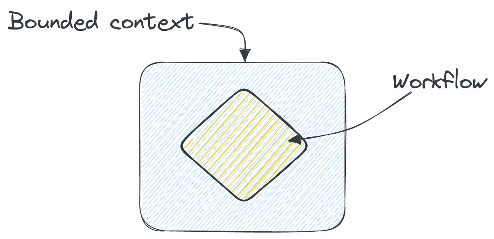
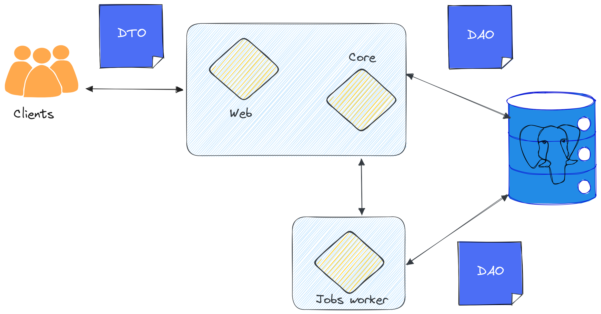

---
css:
  - ./assets/css/variables.css
  - ./assets/css/styles.css
  - ./assets/fonts/stylesheet.css
title: Web Application Architecture in Haskell
subtitle: ”When the domain drives the types, and the types drive the program”
introductory_notes: |
   Welcome to this talk, titled "Web Application Architecture in Haskell –
   When the domain drives the types, and the types drive the program".
   This talk is intended for a mixed audience of software engineers who are acquainted with the practice
   of Domain-Driven Design, and Haskell programmers who are interested in crafting better systems.
   The goal is to create a bridge between the practioners of Domain-Driven Design
   and the users of Haskell.

   The centerpiece of this talk is a community website called Flora.pm, which serves as an alternative
   index for the Haskell packages ecosystem, and also as a vessel for teaching how to architecture
   web applications in Haskell.

#light: true
#ratio43: true
# overlay: "Théophile Choutri"
author:
  # - name: Théophile Choutri
    desc:
      - Backend engineer at Scrive </br> <span class="big-2">&</span>
      - ~~Director~~ Helping hand at the Haskell Foundation

---

# Haskell — Pure, Functional Programming

::: notes
Haskell is a pure, functional programming language.
This brings us several concrete features like native support
for recursion without blowing up your stack, a type system
that doesn't hate you, higher-order functions,
and many other features that almost every language has today
(except when they don't).
:::


---

# Syntax primer

A record declaration
```haskell
data Record = RecordConstructor
  { field1 :: Int
  , field2 :: Bool
  }
```

A pure function: takes an input, produces an output
```haskell
myFunction :: inputType -> outputType
myFunction argument = body
```

---

# Syntax primer

Polymorphism: A function with a constraint
```haskell
--                       Constraint on `input`
--                           ┌──────────┐
myFunctionWithAConstraint :: (Show input) => input -> Text
myFunctionWithAConstraint input = display input
```

### In other languages:

#### TypeScript
```typescript
interface Lengthwise {
  length: number;
}

function loggingIdentity<Type extends Lengthwise>(arg: Type): Type
```

#### Rust
```rust
fn printer<T: Display>(t: T)
```

::: notes
This is ad-hoc polymorphism
:::

---

# Syntax primer


<dl>
  <dt>Observable effects (noted with `IO` in the type)</dt>
  <dd class="explicit-list">
    📟 Writing on the standard I/O streams (`stdin`, `stdout`, `stderr`);<br>
    🔀 Concurrency and reaction to independent input sources;<br>
    ⌛ Exceptions, timeouts.
  </dd>
</dl>

An effectful function:
```haskell
myEffectfulFunction :: (Show inputType) => inputType -> IO Int
myEffectfulFunction argument = do
  -- print :: Show a => a -> IO ()
    print argument
  -- pure :: Int -> IO Int
    pure 1
```

---

# Syntax primer

Remember `Record`? 

<ul class="incremental nobullet">

<li class="">

```haskell
data Record = RecordConstructor
  { field1 :: Int
  , field2 :: Bool
  }
```
</li>

<li>

```haskell
type Record :: Type -- ⚠️
data Record = RecordConstructor
  { field1 :: Int
  , field2 :: Bool
  }
```

</li>
</ul>

::: notes
You remember our record from the other slide? It has a type signature right?
Well guess what, types also have types! They're called kinds and we can specify them.
This is going to be important because now it means that we can have other kind of 
types, like type-level unions. And this is one hell of a nice tool to wield, which we
are going to see later.

:::

---

# Haskell — Pure, Functional Programming

::: notes
And there are two features that I will talk about, its ability
to adequately represent business domains, and its ability to
track side-effects in a semantic way.
:::


1. Represent business domains
2. Semantic tracking of effects

---

# Haskell — Pure, Functional Programming

## Adequate representation of the business domain

```haskell
-- Type-level tag
type data Access
    = Visitor
    | Admin
                           🔒
                         ┌────┐
data User (privileges :: Access) = User
    { userId :: UserId
    , username :: Text
    , […]
    }

viewBackoffice :: User Admin -> IO HTML
viewBackoffice user = …

-- This function cannot be called for a user that has the "Visitor" tag.
-- And it produces side-effects.
```

::: notes
Haskell, through the usage of algebraic data types, allows us to
model with precision the nuances of a real-world business domain.
Encoding rules by construction at the type level is something we
can easily do.
In this example, The members of the `Access` data type are used
at the level of types, and as such we are guaranteed by the type checker
that there can only be two possible inhabitants for the `privileges`
type variable.
:::

---

# Haskell — Pure, Functional Programming

```haskell
                                ❓
                               ┌──┐
viewBackoffice :: User Admin -> IO HTML
```


::: notes
Now, as we saw previously, `IO` stands for a variety of things, and this
is a problem. Gone are the days where I was a mere ape on a typewriter.
I am a systems architect, and I need to know the interdependencies between
the components of my infrastructure, in a way that makes sense at my scale.

How can I make sure that a refactoring does not (or does) change these relationships?
And more importantly: How can I make sure that the compiler is aware of them?

Thus, I require more out of the type system.
:::

---

# Haskell — Pure, Functional Programming

## Track side-effects semantically

```haskell
getEntityName :: Int -> Eff [DB, Redis, Logging] Text

  └─ getEntityFromCache :: (Redis :> effects) => Int -> Eff effects (Maybe Entity)

  └─ getEntityFromDB :: (DB :> effects) => Int -> Eff effects (Maybe Entity)

  └─ logInfo :: (Logging :> effects) => Text -> Eff effects ()
```

::: notes
| Today, we can track with relative precision the effects that are
| being executed throughout the program by declaring them, at the type level.
| We are not merely content with `IO something`.
| Here, the `Eff` type has two parameters: The list of effects, and the return value of the function.
:::

---

# Haskell — Pure, Functional Programming

## The result
<p class="big-1 prose">
  When a type system is both *strong* and *expressive*… <br>
  ➡️  We get a lot closer to fearless refactoring! 🎉
</p>

---

# Haskell — Pure, Functional Programming

## Fearless refactoring:

<div class="center big-1 spaced">
<dl>
  <dt> pros </dt>
  <dd> We get ✨ *vibe checked* 🧐 by the compiler. Pretty cool. </dd>

  <dt>cons</dt>
  <dd> **our worst enemy is ourself**. </dd>
</dl>
</div>

::: notes
What I mean by "fearless refactoring" is that the compiler keeps you in check
regarding the changes in your program and how they affect the program's behaviour.

You also have to come to terms with the fact that your worst enemy is yourself.
:::

---

# Haskell — Pure, Functional Programming

## The limits of “correct by construction”

::: incremental
* Haskell is not a prover.
* Write tests (integration, properties, end-to-end)
:::

---

# Functional Application Architecture

::: notes
This gives us enough tools to focus now on the topic of Functional Application Architecture.\n
This time we arrive in the land of Domain-Driven Design, and there will be a brief review of
the terminology and techniques that were created in the discipline, and how they apply to us.

:::

---

# Bounded Contexts



---

# Bounded Contexts

## Anatomy of a context

<p class="properties">

* An *autonomous* sub-system
    * Is responsible for one or multiple workflows

* Well-defined boundaries
    * We know how to talk to it, its inputs and outputs

* (NewCrafts 2023 exclusive) Heuristics
    * Would it work as a 3rd-party product?
    * Split off the stable and experimental parts
    * Organise around what changes together

(thank you Mathias)
</p>

---

# Bounded Contexts

## Example: Flora.pm


---

# Bounded Contexts

## Terminology

<div class="presentation centered">
<div>

* Data Transfer Object

* Data Access Object

* Business (or Domain) Object
</div>
</div>

---

# Bounded Contexts

## Terminology

<div class="presentation centered">
<div>

* Data Transfer Object

* Data Access Object

* Business (or Domain) Object
</div>

<div class="solid-left-side">
<p class="big-2 text">
They sometimes are the same thing…
</p>
</div>
</div>

---

# Bounded Contexts

## Terminology

<div class="presentation centered">
<div>
* Data Transfer Object

* Data Access Object

* Business (or Domain) Object
</div>

<div class="solid-left-side">
<p class="big-2 text">
They sometimes are the same thing…
</p>
<p class="big-2 text">
But sometimes not.
</p>
</div>
</div>

::: notes
And it really is pure luck that sometimes these types align.
An example of how this bit me when I was a young and hopeful hobbyist without much practice,
is that during a meeting with other people to define a JSON format for data exchange,
we were constraining ourselves based on the languages that we would each use to implement
our servers, and our data storage.
Now I know better, and the format of the data exchange is systematically different from how the
data is processed, and stored.
:::

---

# Bounded Contexts


---

# Bounded Contexts



---

# Bounded Contexts

## Example: Reading Configuration

<div class="presentation">

```haskell
-- | External configuration
data FloraConfig = FloraConfig
  { dbConfig :: PoolConfig
  , connectionInfo :: ByteString
  , domain :: Text
  , httpPort :: Word16
  , logging :: LoggingEnv
  , environment :: DeploymentEnv
  }
```

```haskell
-- | Internal configuration
data FloraEnv = FloraEnv
  { pool :: Pool PG.Connection
  , httpPort :: Word16
  , domain :: Text
  , logging :: LoggingEnv
  , environment :: DeploymentEnv
  , assets :: Assets
  }
```
</p>

<div>


---

# Bounded Contexts

## Example: Reading Configuration

```haskell
-- | The well-typed transformation between the two
configToEnv :: (IOE :> es) => FloraConfig -> Eff es FloraEnv
configToEnv floraConfig = do
  let PoolConfig{connectionTimeout, connections} = floraConfig.dbConfig
  pool <- mkPool floraConfig.connectionInfo connectionTimeout connections
  assets <- getAssets floraConfig.environment
  pure FloraEnv
        { pool = pool
        , httpPort = floraConfig.httpPort
        , domain = floraConfig.domain
        , logging = floraConfig.logging
        , environment = floraConfig.environment
        , assets = assets
        , config = floraConfig
        }
```

---

# Separating Commands & Queries

::: notes
The next topic is the separation between commands and queries at the persistence layer.
This has practical effects in terms of operations infrastructure and in terms of
ergonomics for people who read our code.
:::

---

# Separating Commands & Queries


::: notes
| If we know that we have recurrent, fairly heavy processing
| queries that run and can take significant read locks or CPU time on our server,
| we have the option to have these queries run on a read-only replica of our database
| and put the replica on another machine.
:::

---

# Separating Commands & Queries

```
src/Flora/Model/Package
├── Query.hs
├── Types.hs
└── Update.hs
```

```Haskell
import Flora.Model.Package.Query qualified as Query
[…]
--   Visual Indicator
--       ┌─────┐
result <- Query.getPackageByNamespaceAndName package.namespace package.name
case result of
Just existingPackage -> do
  publishForExistingPackage requirements components release existingPackage
Nothing -> do
  publishForNewPackage requirements components release userPackageCategories package
[…]
```

::: notes
| Separating the location of database operations that change the observable state
| of the database is a good first step.

| This also has a visual impact, and greatly helps with ergonomics.
| I discovered this pattern at my current place of employment, Scrive,
| and it really worked for me, as from a glance I can determine when (and how)
| the database is queried.
:::

---

# Separating Commands & Queries

## Let's go further!

```haskell
getEntityName :: Int -> Eff [DBQuery, Redis, Logging] Text

  └─ getEntityFromCache :: (Redis :> effects) => Int -> Eff effects (Maybe Entity)

  └─ getEntityFromDB :: (DBQuery :> effects) => Int -> Eff effects (Maybe Entity)

  └─ logInfo :: (Logging :> effects) => Int -> Eff effects ()
```
::: notes
We could go further and declare Queries & Commands as effects, with their own connection pool.
:::

---

# Let keep our distance from the state

::: notes
The cache of our application is actually a bounded context of its own.
It has its own lifecycle, data storage, and API. By decoupling our applicative monolith
from its state, we have walked a significant portion of the path to having a setup
where we can have multiple instances of our application, serving data from the same
database and cache.

And at this point, by ensuring that the database server keeps operations in sync,
we've got higher availability for our application.
:::

---

# Let keep our distance from the state


---

# A short detour: Directing our workflows with types

::: notes
| Here I'm going to present a technique that brings together
| type-safety and ergonomics to create type-directed state machines.
| It can be sometimes scary to call what you would think is just
| some arrangement of business operations a "state machine",
| but this also gives us a terminology to think of how we organise
| and compose our operations.
:::

---

# Direct our workflow with types

```haskell
type data WorkflowState
    = Arrival
    | Processed
    | Departure

data Workflow (state :: WorkflowState) = Workflow
    { name :: Text
    }

newWorkflow :: Workflow 'Arrival
newWorkflow = Workflow{ name = "w1" }

processWorkflow :: Workflow 'Arrival -> Workflow 'Processed
processWorkflow w = Workflow{ name = w.name <> ".processed" }

sendBackWorkflow :: Workflow 'Processed -> Workflow 'Departure
sendBackWorkflow w = w{name = w.name <> ".departure"}
```

::: notes
| Let's detail what we have here: First of all, an enum type of possible states.
| Then, we have our Workflow that is parametrised with the members of the WorkflowState type.
| Which means that the 'state' parameter can only have the values that we see above.
|
| `newWorkflow` is a workflow that is set as being on 'Arrival'.
| Which is exactly what the `processWorkflow` function necessitates to
| be able to process it. `sendBackWorkflow` needs a processed workflow
| and enforces this necessity.
|
| Here I do not have to return an option type to signify that I passed the wrong
| workflow to the function, it is impossible for me to have this code compiled and
| sent to production if I do not abide by its rules.
:::

---

# Direct our workflow with types

✅

```haskell
λ❯ newWorkflow
    & processWorkflow
    & sendBackWorkflow
Workflow {name = "w1.processed.departure"}
```

⛔

```haskell
λ❯ newWorkflow & sendBackWorkflow
```

```haskell
<interactive>:16:15: error:
    • Couldn't match type ‘'Processed’ with ‘'Arrival’
      Expected: Workflow 'Arrival -> Workflow 'Departure
        Actual: Workflow 'Processed -> Workflow 'Departure

```
---

# Where not to go from here?

---

# Where not to go from here?

## Database layers that promise type-safe SQL

* Trivial to implement

* Type-level encoding of SQL semantics (golden goose)


::: notes
If we ever find a database layer that promises type safety, either it is
of type safety that is trivial to implement and it's totally expected of the tool to
have it, or it has encoded the semantics of SQL at the type-level and we've either
found the golden egg, or someone has clearly underestimated the difficulty
of SQL semantics.
:::

---

# Where not to go from here?

## SQLite for development, PostgreSQL in production


* Restricted subset of SQL

* Different operational perspectives

::: notes
We can acomplish great things by lying to the universe, but we scarcely accomplish anything by lying to ourselves.
SQLite is its own system,
and unless you somehow perfectly code in the common subset of SQL supported by both implementations, you will
be maintaining two sets of database migrations.
PostgreSQL has very good features, SQLite has different but very good
features, but if you get used to one locally and discover the second one once deployed, you're going to have a bad
time, and your muscle memory will be fairly useless.
:::

---

# Where to go from here?

---

# Produce documentation❗

* Types are not documentation <strong>material</strong>
* Types are documentation <strong>backbone</strong>

::: notes
We hold tremendous modelisation power in the types, and coupled with introspection
means that the algegbraic data types (sums and products) can serve as the backbone for
further documentation.

The types themselves are not documentation, but they can be used to guide the reader.

Remember how I told you to write tests? The best tests are those that can describe
real-world behaviours of your program and from which people who are not purely
technical can learn about the program. If you can even produce a summary
web page that shows the behaviours and the high-level paths taken by the
program according to some input, this is particularly helpful.
:::

---

## Produce documentation

<picture>
  <source media="(prefers-color-scheme: light)" srcset="./assets/img/diataxis-light.webp">
  
</picture>

Diátaxis documentation framework, diataxis.fr

::: notes
With expressive types we can get an API reference more or less for free. 
This is super useful for OpenAPI description and documentation generation tools.
:::

---

# Sources

* _Domain Modeling Made Functional_ by Scott Wlaschin
* _Living Documentation_ by Cyrille Martraire
* _Diátaxis documentation framework_, Daniele Procida, diataxis.fr
* Hideous amounts of caffeine
